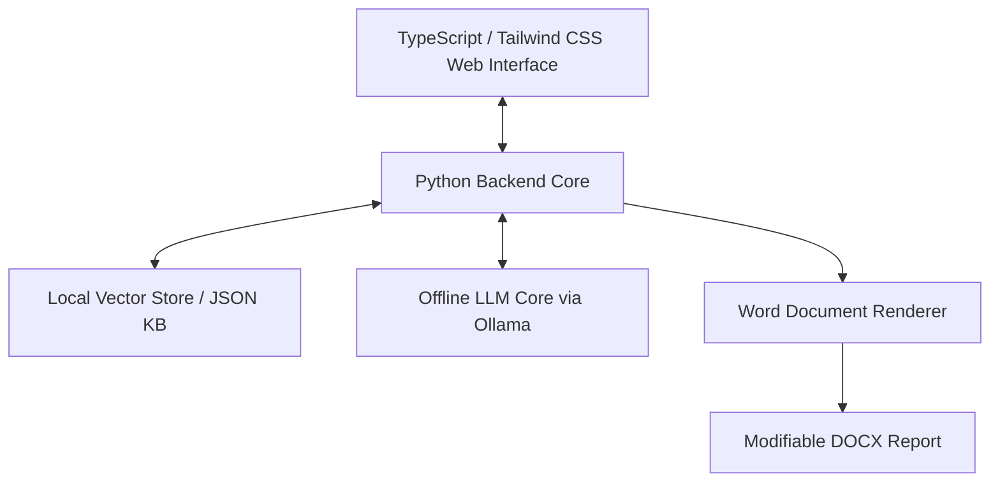

<!--
---
title: "VulnScribe | Offline AI-Powered VAPT Reporting Engine"
meta_title: "VulnScribe | Offline VAPT Reporting Engine by Bhavy Morvadiya"
meta_description: "Secure, 100% offline, AI-powered VAPT report generator by Bhavy Morvadiya (kkaxh1). Automatically train on previous reports to generate editable Word documents (.docx) for Web, API, Mobile, Network, and Active Directory audits."
keywords: "Bhavy Morvadiya, Bhavya Morvadiya, kkaxh1, VulnScribe, VAPT reporting tool, offline pentest report builder, AI vulnerability reporting, automated penetration testing report generator, offline RAG security reporting, editable docx pentest reports, Active Directory assessment tool, cybersecurity report automation"
author: "Bhavy Morvadiya"
canonical: "https://bhavymorvadiya.netlify.app/projects/vulnscribe"
og_type: "website"
og_url: "https://bhavymorvadiya.netlify.app/projects/vulnscribe"
og_title: "VulnScribe | Offline AI-Powered VAPT Reporting Engine by Bhavy Morvadiya"
og_description: "Automatically compile professional, NDA-compliant VAPT reports locally using secure AI trained on your previous data."
og_image: "https://bhavymorvadiya.netlify.app/bhavy_3d_avatar.png"
twitter_card: "summary_large_image"
twitter_site: "@kkaxh1"
twitter_creator: "@kkaxh1"
---
-->

# VulnScribe - Offline AI-Powered VAPT Reporting Engine

**VulnScribe** is an enterprise-grade, secure, and 100% offline security assessment report generation platform. It empowers cybersecurity firms and internal audit teams to rapidly compile professional VAPT reports using context-aware local AI, trained on their historical assessment data. By automating the repetitive draft-writing process, VulnScribe drastically reduces manual reporting overhead, enabling security analysts and testers to dedicate their focus to active vulnerability discovery and security testing.

---

## Key Value Propositions

### 100% Offline & Private
* **Zero Data Leakage**: All data training, vector indexing, retrieval-augmented generation (RAG), and document rendering occur locally on the auditor's workstation or on-premise infrastructure.
* **No Cloud Dependecies**: Does not communicate with any external APIs or cloud services. Fully compliant with strict client NDAs and air-gapped environment requirements.

### Learning from Firm History
* **Tailored Outputs**: Securely ingests and trains on your firm's previous reports, mimicking your specific terminology, finding formatting, and technical depth.
* **Contextual Auto-Completion**: Instantly suggest high-quality impacts, remediation guides, and references based on minimal finding indicators.

### 10+ Standard Assessment Types
Out-of-the-box support for the industry's most common reporting templates, with the capability to customize and append new formats seamlessly:
1. **Web Application VAPT**
2. **API Security Assessment**
3. **Android VAPT**
4. **iOS VAPT**
5. **External Network VAPT**
6. **Internal Network VAPT**
7. **Active Directory Assessment**
8. **Cloud Security Assessment**
9. **Firewall Configuration Review**
10. **Red Team Tactical Assessment**

### Fully Modifiable Formats
* **Lossless Editing**: Generates reports in fully editable Microsoft Word (`.docx`) format, styled exactly to enterprise brand guidelines.
* **Strict Layout Integrity**: Ensures no broken tables, consistent typography (Arial base), vertically centered cells, and colorful native OOXML charts with zero-value suppression.

---

## Architecture & Technology Stack

VulnScribe combines modern frontend technologies with a fast, lightweight local AI backend:



### Technical Stack Components
* **User Interface**: TypeScript and Tailwind CSS for a premium, responsive, and intuitive web dashboard.
* **Backend Intelligence**: Python-based core controller implementing offline semantic retrieval, input preprocessing, and template compilation.
* **Local Inference**: Ollama running quantized open-weights models (e.g., `deepseek-coder` or customized local security models) for lightning-fast, zero-cost generation.

---

## Workflow Overview

```
┌─────────────────────┐
│ 1. Finding Inputs   │ ── Name, Observation, Severity, How Found
└──────────┬──────────┘
           │
           ▼
┌─────────────────────┐
│ 2. Context Retrieval│ ── Checks Offline KB for Past Similar Finding Examples
└──────────┬──────────┘
           │
           ▼
┌─────────────────────┐
│ 3. LLM Refinement   │ ── Formulates Technical Description, Impact, & Actionable Remediations
└──────────┬──────────┘
           │
           ▼
┌─────────────────────┐
│ 4. Report Rendering │ ── Compiles into Branded, Fully Modifiable Word Doc (.docx)
└─────────────────────┘
```
